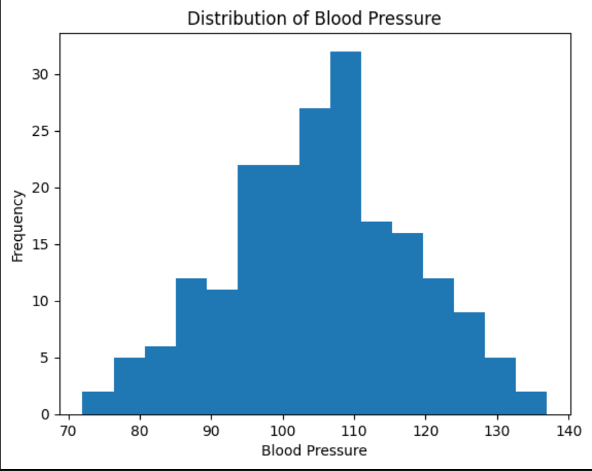
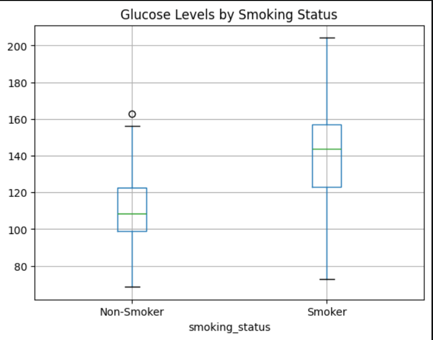
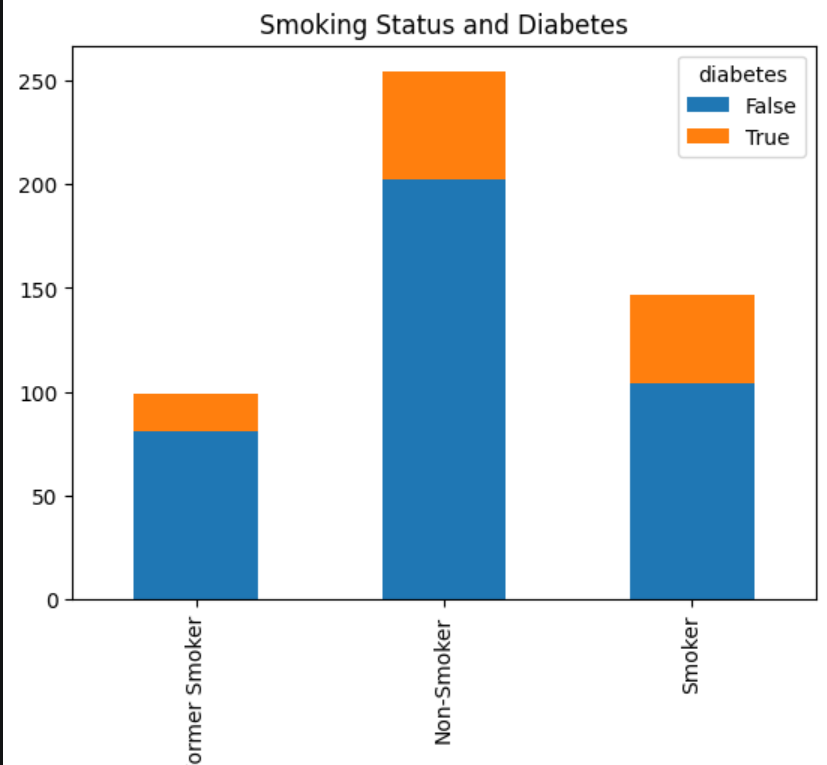
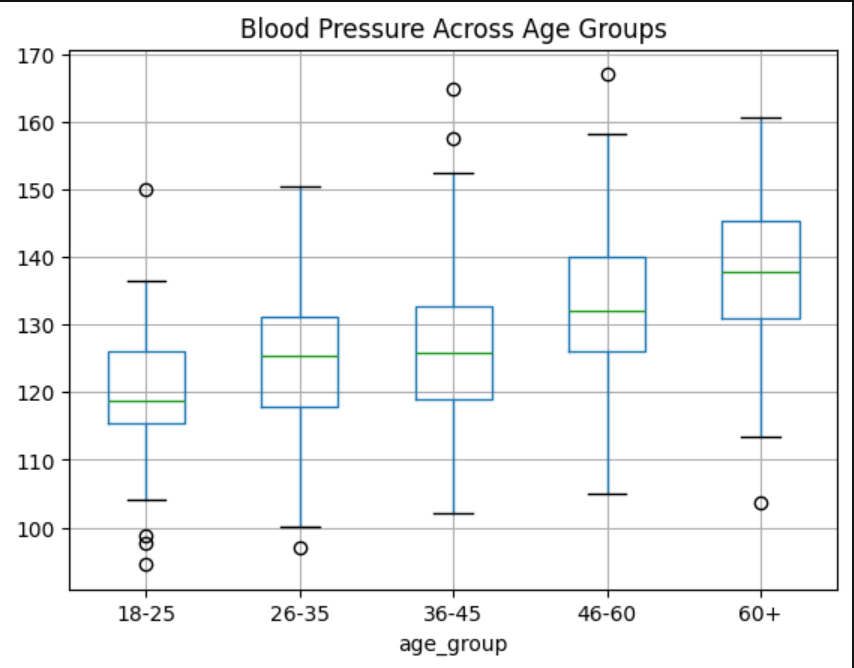
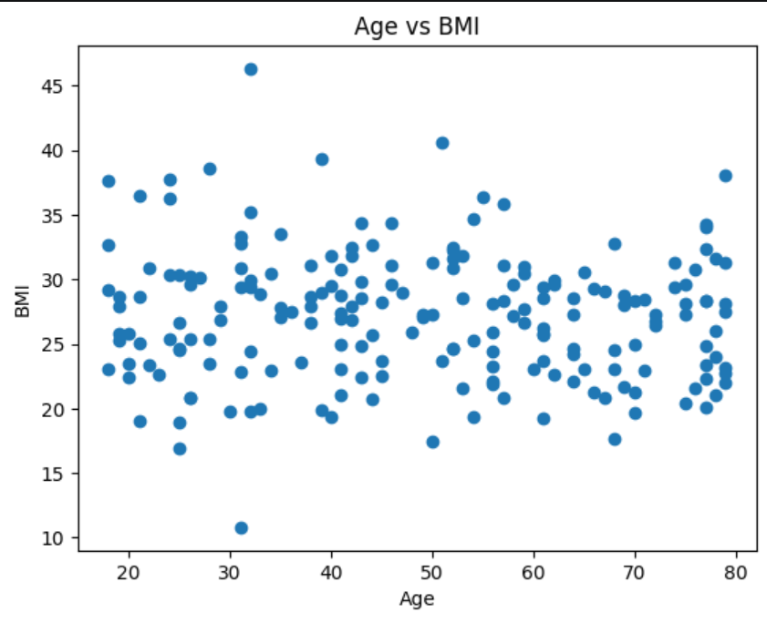

# 🩺 Health Dataset Inferential Statistics Project

## 📌 Overview
This project applies **inferential statistical methods** on a health dataset to analyze relationships between lifestyle factors (smoking, age, BMI) and health outcomes (blood pressure, diabetes, glucose levels).

The goal is to extract meaningful insights using statistical hypothesis testing and data visualization.

---

## 🛠️ Tools & Technologies
- Python 🐍  
- Pandas  
- NumPy  
- Matplotlib  
- SciPy  

---

## 📂 Dataset
File used: `health_dataset.csv`

### Features:
- Age  
- BMI  
- Blood Pressure  
- Glucose Level  
- Smoking Status  
- Diabetes Status  
- Age Groups  

---

## 📚 Statistical Concepts Used

### 📌 Inferential Statistics
Used to draw conclusions about a population using sample data.

---

### 📌 Hypothesis Testing
- **Null Hypothesis (H₀):** No effect or difference  
- **Alternative Hypothesis (H₁):** Effect or difference exists  

Example:  
Smoking has no effect on glucose levels vs smoking affects glucose levels.

---

### 📌 Confidence Interval
A range that estimates the true population parameter with a confidence level (95%).

---

### 📌 P-value Rule
- p-value < 0.05 → Reject H₀  
- p-value ≥ 0.05 → Fail to reject H₀  

---

### 📌 Statistical Tests Used
- **Z-Test:** Large sample comparison  
- **T-Test:** Compare two group means  
- **Chi-Square Test:** Association between categorical variables  
- **ANOVA:** Compare more than two group means  

---

### 📌 Covariance & Correlation
- Covariance → Direction of relationship  
- Correlation → Strength + direction of relationship  

---

## 📊 Analysis & Results

---

## 1️⃣ Confidence Interval: Mean Blood Pressure
A 95% confidence interval was calculated for mean blood pressure.

## 🖼️📊 Screenshots

---

## 2️⃣ T-Test: Glucose Levels (Smokers vs Non-Smokers)
Used to check whether smoking affects glucose levels.

## 🖼️📊 Screenshots

---

## 3️⃣ Chi-Square Test: Smoking Status vs Diabetes
Used to check association between smoking and diabetes.

## 🖼️📊 Screenshots

---

## 4️⃣ ANOVA: Blood Pressure Across Age Groups
Used to compare blood pressure across different age groups.

## 🖼️📊 Screenshots

---

## 5️⃣ Correlation: Age vs BMI
Used to analyze relationship between age and BMI.

## 🖼️📊 Screenshots

---

## 📌 Key Findings

- Smoking significantly affects glucose levels  
- Blood pressure varies across age groups  
- Smoking and diabetes show statistical association  
- Age and BMI are correlated  
- Health factors are interconnected and measurable using statistics  

---

## 📈 Visual Summary

- Histogram: Blood Pressure Distribution  
- Box Plot: Smoking vs Glucose Levels  
- Bar Chart: Smoking vs Diabetes  
- Box Plot: Blood Pressure vs Age Groups  
- Scatter Plot: Age vs BMI  

---

## 📉 Conclusion
This project demonstrates how **inferential statistics** can be used to analyze real-world health data and extract meaningful insights.

Using hypothesis testing, confidence intervals, and correlation analysis, we can identify significant relationships between lifestyle factors and health conditions.

All tests were performed using significance level:

**α = 0.05**

---

## 🚀 Outcome

✔ Statistical reasoning  
✔ Data analysis  
✔ Hypothesis testing  
✔ Data visualization  
✔ Real-world health insights  

---
⭐ **End of Project**
