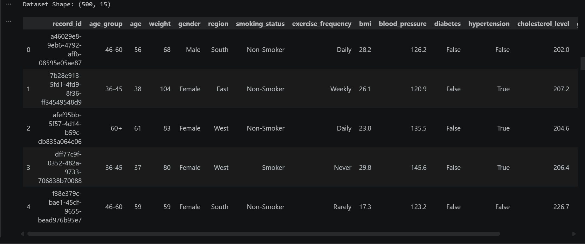
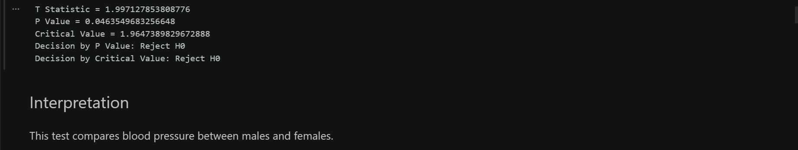
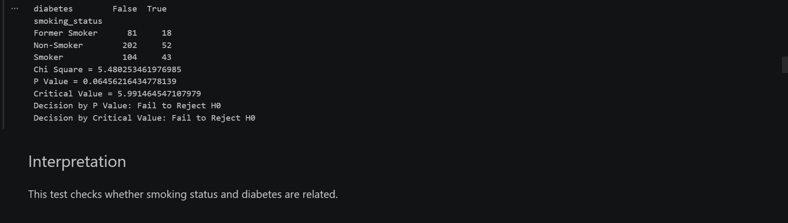
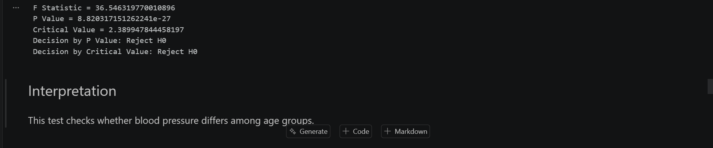
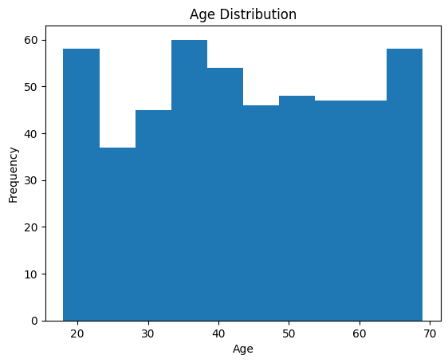
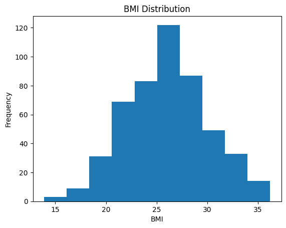
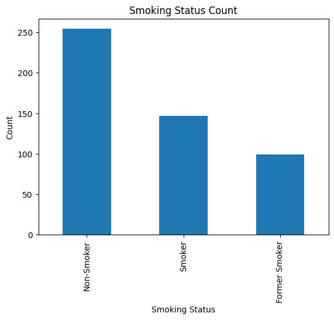

# Inferential Statistics Project

## Project Title
Inferential Statistics Analysis Using Health Dataset

---

## Objective

The objective of this project is to apply inferential statistical techniques on a health dataset and analyze relationships among different health-related variables. This project demonstrates how statistical methods can be used to make conclusions and predictions about a population using sample data.

---

## Introduction

Inferential Statistics is a branch of statistics that enables researchers to draw conclusions about a population based on sample observations. In this project, a health dataset containing demographic and medical information was analyzed using different inferential statistical techniques.

The dataset contains information related to age, gender, weight, BMI, blood pressure, smoking status, diabetes, hypertension, cholesterol level, glucose level, exercise frequency, and region.

The analysis was performed using Python and Jupyter Notebook.

---

## Dataset Description

The dataset contains 500 records and the following attributes:

| Column Name | Description |
|------------|-------------|
| record_id | Unique identifier for each record |
| age_group | Age category |
| age | Age of individual |
| gender | Male or Female |
| weight | Weight in kilograms |
| region | Residential region |
| smoking_status | Smoking habit |
| exercise_frequency | Exercise frequency per week |
| bmi | Body Mass Index |
| blood_pressure | Blood pressure measurement |
| diabetes | Diabetes status |
| hypertension | Hypertension status |
| cholesterol_level | Cholesterol measurement |
| glucose_level | Blood glucose measurement |
| visit_date | Medical visit date |

### Dataset Preview

---

## Theoretical Background

### Inferential Statistics

Inferential Statistics is used to make predictions and draw conclusions about a population based on sample data.

### Hypothesis Testing

Hypothesis testing is a statistical procedure used to evaluate assumptions about a population parameter.

### Null Hypothesis (H₀)

The null hypothesis assumes that there is no significant relationship, effect, or difference between variables.

### Alternative Hypothesis (H₁)

The alternative hypothesis assumes that there is a significant relationship, effect, or difference between variables.

### Confidence Interval

A confidence interval is a range of values that is likely to contain the true population parameter.

### P-Value

The p-value indicates the probability of obtaining the observed result under the assumption that the null hypothesis is true.

Decision Rule:

- p-value < 0.05 → Reject H₀
- p-value ≥ 0.05 → Fail to Reject H₀

### Type I Error

Rejecting a true null hypothesis.

### Type II Error

Failing to reject a false null hypothesis.

### T-Test

Used to compare the means of two groups.

### Chi-Square Test

Used to determine whether two categorical variables are associated.

### ANOVA

Used to compare the means of three or more groups.

### Covariance

Measures how two variables change together.

### Correlation

Measures the strength and direction of the relationship between two variables.

---

## Project Hypotheses

### Hypothesis 1

**Null Hypothesis (H₀):**  
Smoking has no effect on diabetes prevalence.

**Alternative Hypothesis (H₁):**  
Smoking affects diabetes prevalence.

---

### Hypothesis 2

**Null Hypothesis (H₀):**  
The mean blood pressure of males and females is equal.

**Alternative Hypothesis (H₁):**  
The mean blood pressure of males and females is different.

---

### Hypothesis 3

**Null Hypothesis (H₀):**  
The mean blood pressure is the same across all age groups.

**Alternative Hypothesis (H₁):**  
At least one age group has a different mean blood pressure.

---

## Tools and Libraries Used

### Programming Language
- Python

### Libraries
- Pandas
- NumPy
- SciPy
- Matplotlib

### Development Environment
- Jupyter Notebook

---

## Methodology

### Step 1: Dataset Loading

The health dataset was loaded using the Pandas library.

### Step 2: Data Exploration

The dataset structure and records were examined using basic data analysis functions.

### Step 3: Confidence Interval

A 95% confidence interval was calculated for the age variable.

### Step 4: T-Test

An independent T-Test was performed to compare blood pressure between male and female individuals.

### Step 5: Chi-Square Test

A Chi-Square test was conducted to determine whether smoking status and diabetes status are associated.

### Step 6: ANOVA

ANOVA was applied to compare blood pressure across different age groups.

### Step 7: Covariance

Covariance between age and BMI was calculated.

### Step 8: Correlation

Correlation between age and BMI was calculated.

### Step 9: Data Visualization

Histograms and bar charts were created to visualize the data.

---

## Statistical Analysis Performed

### Confidence Interval Analysis

Calculated:
- Mean Age
- Standard Deviation
- Margin of Error
- 95% Confidence Interval

Purpose:
To estimate the population mean age.

#### Output Screenshot

---

### T-Test Analysis

Variables:
- Gender
- Blood Pressure

Purpose:
To determine whether blood pressure differs significantly between males and females.

Outputs:
- T Statistic
- P Value
- Critical Value

#### Output Screenshot

---

### Chi-Square Analysis

Variables:
- Smoking Status
- Diabetes

Purpose:
To determine whether smoking status is associated with diabetes.

Outputs:
- Chi-Square Statistic
- P Value
- Degrees of Freedom
- Critical Value

#### Output Screenshot

---

### ANOVA Analysis

Variables:
- Age Group
- Blood Pressure

Purpose:
To determine whether blood pressure differs among age groups.

Outputs:
- F Statistic
- P Value
- Critical Value

#### Output Screenshot

---

### Covariance Analysis

Variables:
- Age
- BMI

Purpose:
To determine the direction of the relationship between age and BMI.

---

### Correlation Analysis

Variables:
- Age
- BMI

Purpose:
To determine the strength and direction of the relationship between age and BMI.

---

## Data Visualization

### Age Distribution Histogram

### BMI Distribution Histogram

### Smoking Status Bar Chart

These charts help understand patterns and distributions in the dataset.
---

## Results and Interpretation

### Confidence Interval

The confidence interval provides a range within which the true average age of the population is expected to fall.

### T-Test

The T-Test determines whether there is a statistically significant difference in blood pressure between males and females.

### Chi-Square Test

The Chi-Square Test determines whether smoking status and diabetes status are associated.

### ANOVA

The ANOVA test determines whether blood pressure differs significantly among age groups.

### Covariance and Correlation

Covariance and Correlation help evaluate the relationship between age and BMI.

---

## Conclusion

This project successfully applied inferential statistical techniques on a health dataset. Confidence Interval, T-Test, Chi-Square Test, ANOVA, Covariance, and Correlation analyses were performed.

The results demonstrate how inferential statistics can be used to analyze data, test hypotheses, identify relationships among variables, and support data-driven decision making.

---

## Author

**Student Name:** Ajay Sosa

**Course:** Ai ML & Data Science 

**Project:** Inferential Statistics Project

**Submission Date:** 01/06/2026
